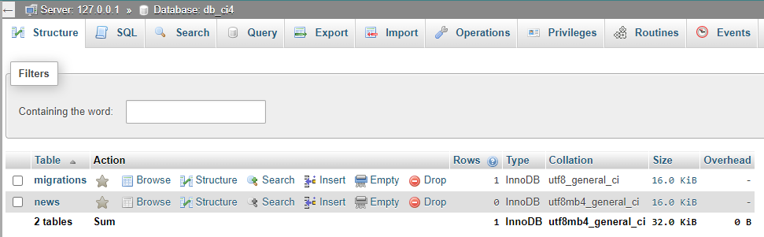

### Sudah sampai Migrasi Database

# Belajar CI 4
~ Page Layout
 * Setiap View yang ingin menggunakan layout harus meng-extend Layoutnya.
    `<?= $this->extend('layout/page_layout') ?>`
 * Setelah itu untuk menampilkan konten harus membuat view sectionn 
    `<?= $this->extend('layout/page_layout') ?>`
    `<?= $this->section('content') ?>`
     konten view di sini 
    `<?= $this->endSection() ?>`

~ View Partial untuk Layout
 * View Partial adalah view yang bisa digunakan kembali. View Partial bisa kita include-kan atau gunakan di dalam Layout maupun View.

~ View Cell
 * View Cell adalah bagian terkecil dari View. Secara teknis, View Cell sebenarnya adalah sebuah Class yang bertugas membuat kode HTML (generate HTML) dengan method-methodnya.
 * Class View Cell bukanlah Controller, karena ia tidak bertugas untuk membalas sebuah request. Ia hanya Class yang bertugas membuat HTML.
 * Fungsi view_cell() adalah fungsi untuk menggunakan View Cell.

~ View Cells dengan Parameter
 * 

~ Controller 
 * Saat fungsi view() dieksekusi, ia akan mencari file view pada folder 📁 app/Views berdasarkan nama file view yang diberikan.
 * Data yang akan dikirim ke view harus dalam bentuk array asosiatif. Array asosiatif adalah array yang memiliki key dan value. Key akan menjadi nama variabel di dalam view, dan value akan menjadi nilainya. Value ini bebas kita isi dengan apa saja.. boleh diisi dengan string, array, object, integer, dll
 
~ Migrasi Database 
 * Pada Codeigniter 4.. kita sudah disediakan program khusus, yakni melalui spark.
 * Perintah-perintah untuk membuat migrasi database dengan spark, bisa kita lihat dengan perintah php spark --help.
 * Jika kamu bingung dengan cara menggunakan perintah tersebut, bisa lihat bantuannya dengan contoh perintah: `php spark help migrate:create`
 * Untuk membuat file migrasi: `php spark migrate:create news`
 * isi file `2020-11-23-053942_news.php` terdapat 2 yaitu method up() akan dijalankan saat melakukan migrasi, sedangkan down() saat melakukan rollback. 
 * setelah menjalankan perintah `php spark migration` maka table pada db_ci4 akan menjadi seperti 
